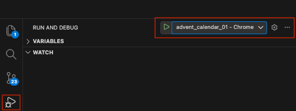

# ZodArt examples

This project contains examples for [ZodArt package](https://pub.dev/packages/zodart).

To learn more about ZodArt see the [documenation page](https://zodart.mergepanic.com).

## Getting Started

To run an example:

1. Install [Flutter](https://flutter.dev)

2. Use `Run and Debug` for VS Code ([Google Chrome](https://www.google.com/chrome/) is required)

    
